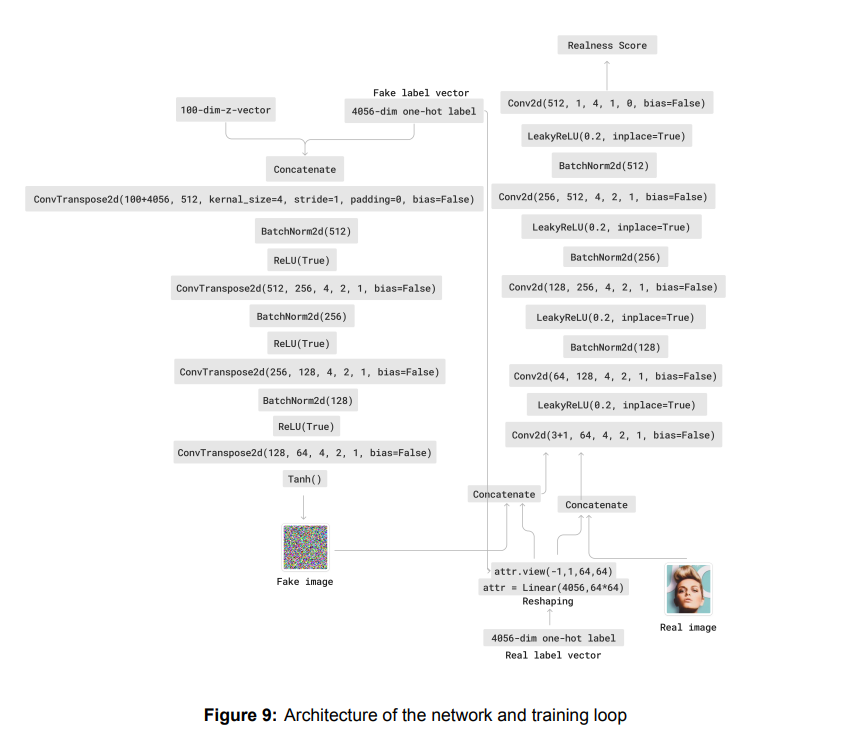
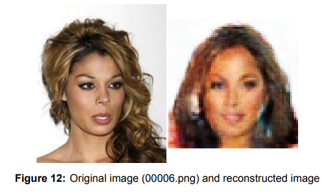
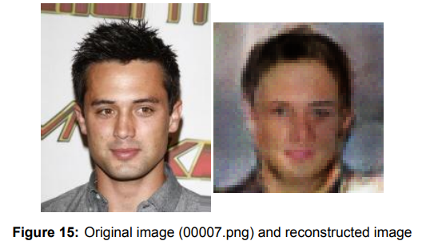
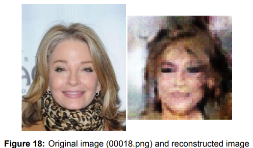

# Face Reconstruction from Feature Vectors 

## Using a GAN-Based Method 

### Introduction 
This thesis explores the potential of Constrained Deep Convolutional Generative Adversarial
Networks (CDCGAN) to reconstruct detailed facial images from feature vectors. The feature vectors in this project capture critical facial characteristics such as geometry, texture, and key landmarks, which the model seeks to convert back into corresponding images. 

The study focuses on the efficacy of a CDCGAN in handling complex data transformation, with potential applications in areas like digital forensics. 

The results highlighted both the potential and challenges of CDCGANs in generating high-fidelity facial reconstructions from compressed data.

### Architecture

The CDCGAN architecture is based on the paper:

[Unsupervised Representation Learning with Deep Convolutional Generative Adversarial Networks](https://arxiv.org/pdf/1511.06434)

The final architecture:

  

### Results 

Here are some of the generated facial reconstructions:

  
  
  

### Paper 

Detailed graphs for the loss of the discriminator and generator over time, along with a thorough discussion about the results and theoretical background, can be found in the thesis paper at:

***DiVA portal: link to come***
